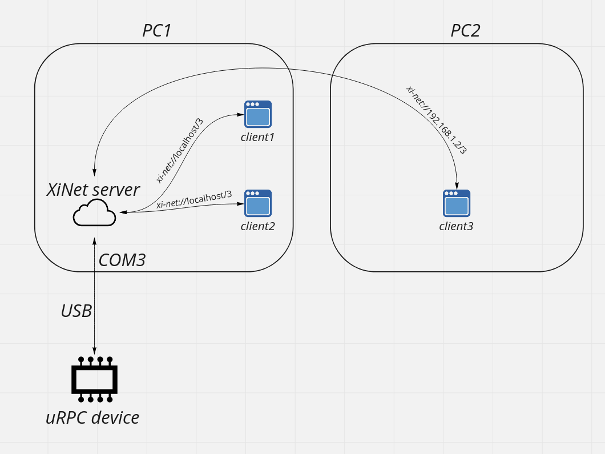

# liburpc

liburpc это протоколонезависимая часть библиотеки uRPC

Обычно она собирается либо как часть библиотеки uRPC для работы по какому-то протоколу 
(например, как часть liburmc, liburlaser, liburio - эти библиотеки генерируются на 
urpc.ximc.ru из файла с описанием протокола, и liburpc входит в них), либо как XiNet сервер

## Библиотека

Для сборки liburpc нужно сделать всего лишь cmake + make, но это принято делать в отдельной папке build, чтобы не замусоривать этот и все зависимые проекты временными файлами:
```shell
mkdir build
cd build
cmake ..
make -j$(nproc)
```

Скорее всего, вам не нужно это делать: обычно liburpc идёт вместе с библиотекой 
под конкретное устройство (liburmc, liburlaser и т.п.) и автоматически собирается вместе с 
ней.

## XiNet сервер

XiNet это сервер, который запускается на Cubieboard 
(https://doc.xisupport.com/en/8smc5-usb/8SMCn-USB/Related_products/Control_via_Ethernet/Ethernet_adapters_Overview.html). 
Он нужен для работы с контроллерами по сети. Этот сервер не зависит от протокола, по сути он просто перенаправляет 
TCP трафик от xi-net://{host}/{serial} в /dev/ximc/{serial} и обратно. 
В этом же сервере есть мультиплексор. Это значит, можно запустить его на хосте, где подключено устройство, и 
подключать несколько клиентов через этот сервер. 

Для сборки xinet сервера надо встать в папку devxinet и сделать cmake + make, как и ранее, создав отдельную папку build:
```shell
cd devxinet
mkdir build
cd build
cmake .. -DCMAKE_BUILD_TYPE=Release
make -j$(nproc)
```

Для релизной сборки важно указать -DCMAKE_BUILD_TYPE=Release: обращения к xinet серверу
на БВВУ происходят часто, и этот код должен быть собран с высокой оптимизацией, иначе 
сервер будет зависать.

Запуск:
```shell
./urpc-xinet-server <путь_до_keyfile.sqlite> 
```
Для запуска сервера требуются права на доступ к последовательным портам в директории `/dev`
(пользователь должен входить в группу `dialout` или быть `root`).

На Linux сервер ищет устройства в директории `/dev/ximc`,
поэтому перед началом работы нужно создать ссылки на устройства в соответствующей директории:

```shell
sudo mkdir /dev/ximc
sudo ln /dev/ttyACM0 /dev/ximc/00000001
```

На Windows, чтобы подключить клиент к устройству `COMn` через XiNet сервер, нужно указать адрес `xi-net://localhost/n`
(например, для открытия устройства с `COM3`, адрес будет `xi-net://localhost/3`).

На Linux, чтобы подключить клиент к устройству `/dev/ximc/<device>` через XiNet, нужно указать адрес `xi-net://localhost/<device>`
(например, для открытия устройства с `/dev/ximc/00000005`, адрес будет `xi-net://localhost/00000005`).

Вместо localhost может быть IP адрес компьютера, к которому подключено устройство.

В целом всё работает как-то так:


